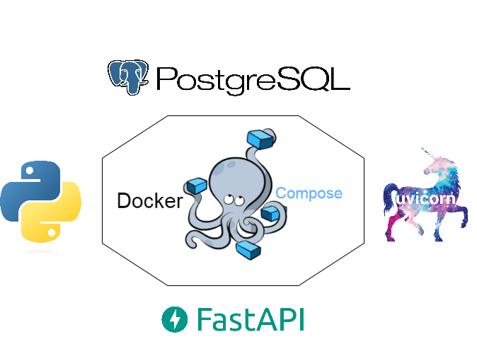
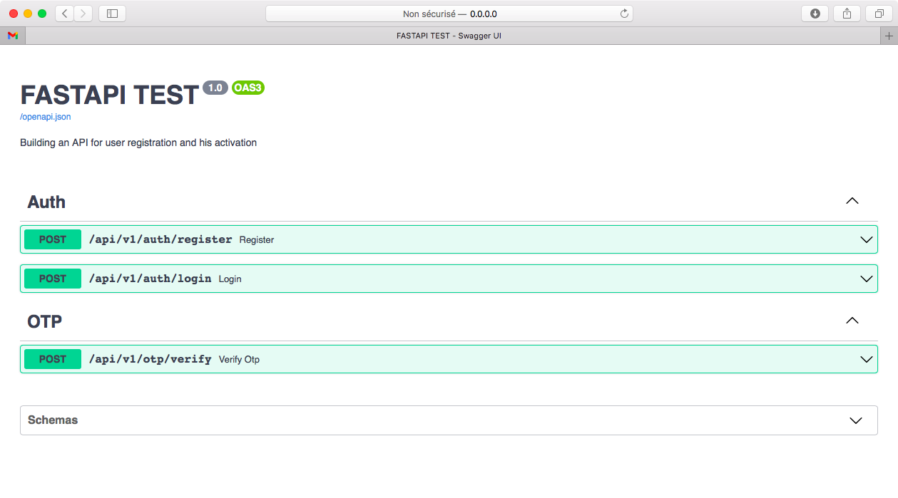

# fastapi-test
Building a user registration API

## Context

Building a user registration API :
User is able to :
- Create an account
- Receeive code OTP by email to verify the account.
- Login into account


## Specifications
You have to manage a user registration and his activation.

## Architecture schema


Global Architecture : 

```
.
├── docker-compose.yml
├── Dockerfile
├── requirements.txt
├── api
│   ├── config.py
│   ├── main.py
│   ├── models.py
│   ├── auth
│   │   ├── crud.py
│   │   ├── router.py
│   │   └── schemas.py
│   ├── otps
│   │   ├── crud.py
│   │   ├── router.py
│   │   └── schemas.py
│   ├── exceptions
│   │   └── business.py
│   └── utils
│       ├── constantUtil.py
│       ├── cryptoUtil.py
│       ├── dateUtil.py
│       ├── dbUtil.py
│       ├── emailUtil.py
│       ├── jwtUtil.py
│       └── otpUtil.py
├── mvenv
├── images
│   └── architecture_scema.png
├── tree.txt
└── README.md
```

Containerize application :

```
├── docker-compose.yml
├── Dockerfile
```

In this Application, we have created 2 services:

1. Database Service (db)
* It is a docker image of postgres (postgres:13-alpine). 
* This layer is responsible for all database operations.
* Any user don't have direct access to this layer.

2. Backend/Python API Service (api)
* It uses docker image of fastapi-test.
* This layer interacts with the database.
* This layer is also responsible for creating various API routes for interacting with the database service.

**requirements.txt** : All the dependencies needed to install

API Structure 
```
├── api
│   ├── config.py
│   ├── main.py
│   ├── models.py
│   ├── auth
│   │   ├── crud.py
│   │   ├── router.py
│   │   └── schemas.py
│   ├── otps
│   │   ├── crud.py
│   │   ├── router.py
│   │   └── schemas.py
│   ├── exceptions
│   │   └── business.py
│   └── utils
│       ├── constantUtil.py
│       ├── cryptoUtil.py
│       ├── dateUtil.py
│       ├── dbUtil.py
│       ├── emailUtil.py
│       ├── jwtUtil.py
│       └── otpUtil.py
```

1. Config API :

```
├── api
│   ├── config.py
│   ├── main.py
│   ├── models.py
```
* **config.py** file will have the configurations and Environment Variables necessary for the project to be validated with Pydantic
* **main.py** file is the root level file of our project from where the project will run
* **models.py** file will contain the models needed for database

2. Routers API :

Folder will contain all the apps which are going to be used in our project, each app file will contain all the APIs needed for that app

Our API contains 2 routers `auth` (for registraion user) and `otps` (for generating code otp):
```
│   ├── auth
│   │   ├── crud.py
│   │   ├── router.py
│   │   └── schemas.py
│   ├── otps
│   │   ├── crud.py
│   │   ├── router.py
│   │   └── schemas.py
```

Every Router Contains : 

* **crud.py** : file will contain the database queries for evrey request
* **router.py** : file will have the specific requests
* **schemas.py** : file will have the schema pydantic schema for the requests

```
│   ├── exceptions
│   │   └── business.py
│   └── utils
│       ├── constantUtil.py
│       ├── cryptoUtil.py
│       ├── dateUtil.py
│       ├── dbUtil.py
│       ├── emailUtil.py
│       ├── jwtUtil.py
│       └── otpUtil.py
```
* **exceptions** : Folder for Handle exceptions
* **utils** : Folder for some utilities

## Settings For Sending Emails

1. Add your own Credentials in `api/.env` : 

```
# Email Configuration:
MAIL_USERNAME=
MAIL_PASSWORD=
MAIL_FROM=
MAIL_PORT=587
MAIL_SERVER=smtp.gmail.com
MAIL_TLS=True
MAIL_SSL=False
USE_CREDENTIALS=True
```

## Lunch & Test App

For Test : 

```
docker-compose up --build
```
If evreything is running successfully , you should view something like this in your console :

```
db_1   | PostgreSQL Database directory appears to contain a database; Skipping initialization
db_1   | 
db_1   | 2022-12-16 18:43:09.129 UTC [1] LOG:  starting PostgreSQL 13.9 on x86_64-pc-linux-musl, compiled by gcc (Alpine 12.2.1_git20220924-r4) 12.2.1 20220924, 64-bit
db_1   | 2022-12-16 18:43:09.130 UTC [1] LOG:  listening on IPv4 address "0.0.0.0", port 5432
db_1   | 2022-12-16 18:43:09.130 UTC [1] LOG:  listening on IPv6 address "::", port 5432
db_1   | 2022-12-16 18:43:09.183 UTC [1] LOG:  listening on Unix socket "/var/run/postgresql/.s.PGSQL.5432"
db_1   | 2022-12-16 18:43:09.281 UTC [19] LOG:  database system was interrupted; last known up at 2022-12-16 12:15:22 UTC
db_1   | 2022-12-16 18:43:10.149 UTC [19] LOG:  database system was not properly shut down; automatic recovery in progress
db_1   | 2022-12-16 18:43:10.179 UTC [19] LOG:  redo starts at 0/15F2640
db_1   | 2022-12-16 18:43:10.179 UTC [19] LOG:  invalid record length at 0/15F2728: wanted 24, got 0
db_1   | 2022-12-16 18:43:10.179 UTC [19] LOG:  redo done at 0/15F26F0
db_1   | 2022-12-16 18:43:11.459 UTC [1] LOG:  database system is ready to accept connections
fastapi-test | INFO:     Will watch for changes in these directories: ['/']
fastapi-test | INFO:     Uvicorn running on http://0.0.0.0:5000 (Press CTRL+C to quit)
fastapi-test | INFO:     Started reloader process [1] using StatReload
fastapi-test | INFO:     Started server process [7]
fastapi-test | INFO:     Waiting for application startup.
fastapi-test | INFO:     Application startup complete.
```

For Prod : 
```
docker-compose up -d
```

you should view something like this in your console :

```
Starting fastapitest_db_1
Starting fastapi-test
```

To check the logs, run:

1. For the whole App

```
docker-compose logs
```

2. For the Database

```
docker logs fastapitest_db_1
```

3. For the API

```
docker logs fastapi-test
``` 

After running “docker-compose up --build” all the containers will start automatically. 
Now our application will be up & running on your browser (`http://0.0.0.0:5000/docs#/`)
You will see the automatic interactive API documentation (provided by Swagger UI):




## Licence

* Copyright (c) 2022 Tayssir Boubaker

## Thanks